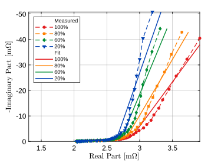

# EIS EATON EDLC Fit Plot

This repo contains electrochemical impedance spectroscopy (EIS) data and scripts
used for fitting and plotting EATON electric double-layer capacitors (EDLCs).

The workflow is split between MATLAB and Python:

- MATLAB extracts the useful columns from exported measurement CSV files.
- Python fits equivalent-circuit models with the `impedance` package.
- MATLAB makes the Nyquist plots, fit plots, error plots, and power plots.
- Python collects some fit results into LaTeX tables.

The repo includes measured data and generated fit outputs for `1F`, `60F`, and
`400F` capacitors at different states of charge.



Example generated by the repo: measured 400F Nyquist data and the Bisquert
open-circuit fit at different SOC levels.

## Repository Layout

```text
.
|-- extract_nyquist_all_soc.m
|-- eis_fit.py
|-- eis_tables.py
|-- plotting/
|-- 1F/
|   `-- SOC/
|-- 60F/
|   `-- SOC/
`-- 400F/
    `-- SOC/
```

Each capacitor folder follows the same basic pattern:

```text
<capacitance>F/SOC/<SOC>%SOC/
```

Examples:

```text
1F/SOC/40%SOC/
60F/SOC/80%SOC/
400F/SOC/100%SOC/
```

Inside each SOC folder, the important file types are:

| File pattern | Meaning |
| --- | --- |
| `<cap>F-<SOC>SOC.csv` | Original exported measurement CSV |
| `<cap>F-<SOC>%SOC_Python.csv` | Three-column file used by Python: frequency, real impedance, imaginary impedance |
| `<cap>F-<SOC>%SOC_Fit.csv` | Fitted impedance data |
| `<cap>F-<SOC>%SOC_Fit_params.csv` | Fitted circuit parameters |
| `<cap>F-<SOC>%SOC_Fit_errors.csv` | Fit residuals/errors |
| `<cap>F-<SOC>%SOC_Fit_rmse.csv` | RMSE for the fit |
| `<cap>F-<SOC>%SOC_Fit_mu.csv` | Lin-KK `mu` value |
| `<cap>F-<SOC>%SOC_Fit_kkResults.csv` | Lin-KK summary values |

The folder name and file names matter. The scripts expect names like `40%SOC`
and `400F-40%SOC_Python.csv`.

## Requirements

Python:

```bash
python -m venv .venv
source .venv/bin/activate
pip install -r requirements.txt
```

Main Python packages:

- `impedance`
- `numpy`
- `pandas`
- `matplotlib`

MATLAB:

- MATLAB with `readtable`, `readmatrix`, and standard plotting functions.
- The original plotting scripts used helper functions from a MATLAB
  Professional Plots setup: `PLOT_STANDARDS`, `STANDARDIZE_FIGURE`, and
  `SAVE_MY_FIGURE`.
- This repo includes small local replacements for those helpers in
  `plotting/`, so the plots can run from a fresh clone. The local helpers
  keep the output plain and publication-style instead of depending on the
  external package theme.

## Data Extraction

Use `extract_nyquist_all_soc.m` to create the `_Python.csv` files from the exported
measurement CSV files.

Run it from MATLAB:

```matlab
extract_nyquist_all_soc
```

When prompted, enter the capacitor folder name:

```text
1F
60F
400F
```

Or pass the folder name directly:

```matlab
extract_nyquist_all_soc('400F')
```

The script looks for:

```text
<capacitance>F/SOC/*%SOC/
```

For each SOC folder, it reads the canonical measurement CSV and writes:

```text
<capacitance>F-<SOC>%SOC_Python.csv
```

The extraction currently uses columns 6, 11, and 12 from the exported CSV:

- frequency
- real impedance
- imaginary impedance

The notes and screenshots in `1F/SOC/Readme/` and `60F/SOC/Readme/` show the
expected folder setup and export style.

## Python Fitting

Run the fitting scripts from inside the matching `SOC` folder.

Example:

```bash
cd 1F/SOC
python fit_bisquert.py
```

Other fitting scripts:

```text
1F/SOC/fit_bisquert.py
1F/SOC/fit_distinct.py
1F/SOC/fit_bisquert_cutoff.py
60F/SOC/fit_bisquert.py
400F/SOC/fit_bisquert.py
400F/SOC/fit_distinct.py
```

These files are small wrappers around `eis_fit.py`. The wrappers keep the
model-specific settings near the data: circuit string, initial guesses, bounds,
parameter names, optional cutoff frequency, and whether to show a diagnostic
plot.

The shared workflow searches the SOC subfolders for `*_Python.csv`, fits the
configured circuit, and writes fit outputs next to the input files.

The Bisquert scripts use:

```text
R_0-B_1
```

The distinct model scripts use:

```text
R_1-Wo_1-p(CPE_1,R_2-CPE_2)
```

For the Bisquert open-circuit model, the ESR-related circuit element is named
`R_0`.

Important: running a fitting script writes new `_Fit*.csv` files. If existing
results matter, copy them somewhere else first.

## MATLAB Plotting

Run the plotting scripts from MATLAB.

Example:

```matlab
run('400F/SOC/SOCFitPlot.m')
```

Useful MATLAB scripts:

| Script | Purpose |
| --- | --- |
| `SOCPlot.m` | Plot measured Nyquist data across SOC values |
| `SOCFitPlot.m` | Plot measured data with fitted curves |

Each capacitor has small `SOCPlot.m` and `SOCFitPlot.m` entry scripts. They set
the few things that differ between capacitors:

- omitted SOC defaults
- marked frequencies and tolerances
- axis limits
- output file names
- optional animation export for `400F`

The shared plotting code lives in:

```text
plotting/plot_soc_measured.m
plotting/plot_soc_fit.m
```

Those helpers use the folder containing the entry script, not MATLAB's current
working directory. They look for SOC subfolders below that `SOC` folder and
write figures to a local `Figures` folder.

Some scripts ask which SOC values to omit from a plot.

For batch runs without prompts:

```bash
EIS_SKIP_PROMPTS=1 EIS_OMIT_SOC=none matlab -batch "run('400F/SOC/SOCFitPlot.m')"
```

Older plot variants and one-off analysis scripts are in `extras/` folders under
each `SOC` folder. This keeps the main folder readable without deleting useful
old plotting work. Examples include frequency-label plots, legend-layout
variants, `MaxPower.m`, `RelativeError.m`, and `PlottingBasic.m`.

## Using Another Capacitor

The scripts are still written around this repo's file naming pattern, but the
main MATLAB and Python code is no longer copied per capacitor.

For another capacitor, create the same folder layout:

```text
<capacitance>F/SOC/<SOC>%SOC/
```

Then add small wrapper scripts in `<capacitance>F/SOC/`:

- Python: copy the closest `fit_*.py` wrapper and adjust the circuit, guesses,
  bounds, and parameter names.
- MATLAB: copy `SOCPlot.m` and `SOCFitPlot.m` from the closest capacitor and
  adjust the config block.

The shared Python code is in `eis_fit.py` and `eis_tables.py`. The shared MATLAB
plotting code is in `plotting/`.

## Tables

The table scripts collect generated fit results into LaTeX tables.

Examples:

```bash
cd 60F/SOC
python write_fit_tables.py
python write_params_bisquert.py
```

Related scripts:

```text
1F/SOC/write_fit_tables.py
1F/SOC/write_params_bisquert.py
1F/SOC/write_params_distinct.py
60F/SOC/write_fit_tables.py
60F/SOC/write_params_bisquert.py
400F/SOC/write_fit_tables.py
400F/SOC/write_params_bisquert.py
400F/SOC/write_params_distinct.py
```

These scripts write `.tex` files into the same `SOC` folder.

The table scripts are wrappers around `eis_tables.py`.

## Tests

This repo has a small CI smoke test for the Python side:

```bash
python -m unittest discover -s tests -p "test_*.py"
```

The test checks that the Python wrappers import, sample impedance data can be
read, the shared fitting setup is wired, and the MATLAB entry scripts point to
the shared plotting code.

There is also a local MATLAB smoke test:

```bash
matlab -batch "addpath('tests'); run_matlab_smoke"
```

That runs MATLAB Code Analyzer on the main `.m` files and then runs the six main
plotting scripts. It writes PDFs to ignored `Figures` folders.

GitHub Actions runs the Python smoke test on push and pull request. The MATLAB
smoke test is local because it needs a MATLAB install.

## Notes And Limitations

- This is a research/thesis workflow repo, not a packaged Python library.
- The data layout is part of the workflow. Renaming folders will break scripts
  unless the paths are updated.
- The MATLAB plot helpers in `plotting/` are compatibility replacements
  for the Professional Plots helpers used while making the original figures.
- The Python fitting scripts contain model choices, bounds, and initial guesses
  directly in each file.
- The generated CSV results are committed so the repo can be inspected without
  rerunning all fits.
- Some plots have manual legend and axis settings. Adjust those in the small
  `SOCPlot.m` or `SOCFitPlot.m` config block when making a new figure.

## Quick Start

For an existing dataset already in this repo:

```bash
python -m venv .venv
source .venv/bin/activate
pip install -r requirements.txt
cd 400F/SOC
python fit_bisquert.py
```

Then in MATLAB:

```matlab
run('400F/SOC/SOCFitPlot.m')
```

For new exported measurement CSV files:

1. Put each measurement in the matching `<capacitance>F/SOC/<SOC>%SOC/` folder.
2. Run `extract_nyquist_all_soc.m` from MATLAB and enter `1F`, `60F`, or `400F`.
3. Run the matching Python fitting script from the `SOC` folder.
4. Run the MATLAB plotting script for that capacitor.
