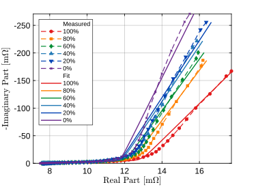

# EIS EATON EDLC Fit Plot

This repo contains electrochemical impedance spectroscopy (EIS) data and scripts
used for fitting and plotting EATON electric double-layer capacitors (EDLCs).
It started as bachelor-thesis work in a battery and power-electronics setting.

The work is split between MATLAB and Python:

- MATLAB extracts the useful columns from exported measurement CSV files.
- Python fits equivalent-circuit models with the `impedance` package.
- MATLAB makes the Nyquist plots, fit plots, error plots, and power plots.
- Python collects some fit results into LaTeX tables.

The repo includes measured data and generated fit outputs for `1F`, `60F`, and
`400F` capacitors at different states of charge.



Example generated by the repo: measured 60F Nyquist data and the Bisquert
open-circuit fit at different SOC levels.

This work is connected to the IEEE ECCE paper:
[EIS-Based State of Charge Characterization of Electric Double-Layer Capacitors](https://ieeexplore.ieee.org/abstract/document/11238903).

## Requirements

Python:

```bash
python -m venv .venv
source .venv/bin/activate
pip install -r requirements.txt
```

Main Python packages:

- `impedance`
- `numpy`
- `pandas`
- `matplotlib`

MATLAB:

- MATLAB with `readtable`, `readmatrix`, and standard plotting functions.
- The original plotting scripts used a MATLAB Professional Plots setup:
  `PLOT_STANDARDS`, `STANDARDIZE_FIGURE`, and `SAVE_MY_FIGURE`.
- This repo includes small local replacements in `plotting/`, so the plots can
  run from a fresh clone without that external setup.

## Quick Start

For data that is already in this repo:

```bash
cd 400F/SOC
python fit_bisquert.py
```

Then make the MATLAB fit plot from the repo root:

```matlab
run('400F/SOC/SOCFitPlot.m')
```

The Python script writes new `_Fit*.csv` files inside each SOC folder. The
MATLAB script writes the plot PDF to:

```text
400F/SOC/Figures/
```

For new measurement exports:

1. Put each CSV in the matching `<capacitance>F/SOC/<SOC>%SOC/` folder.
2. Run `extract_nyquist_all_soc.m` in MATLAB.
3. Run the matching Python fit script from the `SOC` folder.
4. Run `SOCPlot.m` or `SOCFitPlot.m` in MATLAB.

## Where Things Are

```text
.
|-- extract_nyquist_all_soc.m
|-- eis_fit.py
|-- eis_tables.py
|-- plotting/
|-- 1F/
|   `-- SOC/
|       |-- SOCPlot.m
|       |-- SOCFitPlot.m
|       |-- plot_variants/
|       `-- Figures/
|-- 60F/
|   `-- SOC/
|       |-- SOCPlot.m
|       |-- SOCFitPlot.m
|       |-- plot_variants/
|       `-- Figures/
`-- 400F/
    `-- SOC/
        |-- SOCPlot.m
        |-- SOCFitPlot.m
        |-- plot_variants/
        `-- Figures/
```

Each capacitor folder follows the same basic pattern:

```text
<capacitance>F/SOC/<SOC>%SOC/
```

Examples:

```text
1F/SOC/40%SOC/
60F/SOC/80%SOC/
400F/SOC/100%SOC/
```

Inside each SOC folder, the important file types are:

| File pattern | Meaning |
| --- | --- |
| `<cap>F-<SOC>SOC.csv` | Original exported measurement CSV |
| `<cap>F-<SOC>%SOC_Python.csv` | Three-column file used by Python: frequency, real impedance, imaginary impedance |
| `<cap>F-<SOC>%SOC_Fit.csv` | Fitted impedance data |
| `<cap>F-<SOC>%SOC_Fit_params.csv` | Fitted circuit parameters |
| `<cap>F-<SOC>%SOC_Fit_errors.csv` | Fit residuals/errors |
| `<cap>F-<SOC>%SOC_Fit_rmse.csv` | RMSE for the fit |
| `<cap>F-<SOC>%SOC_Fit_mu.csv` | Lin-KK `mu` value |
| `<cap>F-<SOC>%SOC_Fit_kkResults.csv` | Lin-KK summary values |

The folder name and file names matter. The scripts expect names like `40%SOC`
and `400F-40%SOC_Python.csv`.

## Data Extraction

Use `extract_nyquist_all_soc.m` to create the `_Python.csv` files from the exported
measurement CSV files.

Run it from MATLAB:

```matlab
extract_nyquist_all_soc
```

When prompted, enter the capacitor folder name:

```text
1F
60F
400F
```

Or pass the folder name directly:

```matlab
extract_nyquist_all_soc('400F')
```

The script looks for:

```text
<capacitance>F/SOC/*%SOC/
```

For each SOC folder, it reads the canonical measurement CSV and writes:

```text
<capacitance>F-<SOC>%SOC_Python.csv
```

The extraction currently uses columns 6, 11, and 12 from the exported CSV:

- frequency
- real impedance
- imaginary impedance

The old export notes and screenshots are in `docs/export_notes/`.

## Fitting In Python

Run the fitting scripts from inside the matching `SOC` folder.

Example:

```bash
cd 1F/SOC
python fit_bisquert.py
```

Other fitting scripts:

```text
1F/SOC/fit_bisquert.py
1F/SOC/fit_distinct.py
1F/SOC/fit_bisquert_cutoff.py
60F/SOC/fit_bisquert.py
400F/SOC/fit_bisquert.py
400F/SOC/fit_distinct.py
```

Each fit script contains the model settings for that capacitor: circuit string,
initial guesses, bounds, parameter names, optional cutoff frequency, and whether
to show a diagnostic plot.

When you run a fit script, it searches the SOC folders for `*_Python.csv` files,
fits the selected circuit, and writes the results next to the input data.

The Bisquert scripts use:

```text
R_0-B_1
```

The distinct model scripts use:

```text
R_1-Wo_1-p(CPE_1,R_2-CPE_2)
```

For the Bisquert open-circuit model, the ESR-related circuit element is named
`R_0`.

Important: running a fitting script writes new `_Fit*.csv` files. If existing
results matter, copy them somewhere else first.

## Plotting In MATLAB

Run the plotting scripts from MATLAB.

Example:

```matlab
run('400F/SOC/SOCFitPlot.m')
```

Most useful MATLAB scripts:

| Script | Purpose |
| --- | --- |
| `SOCPlot.m` | Plot measured Nyquist data across SOC values |
| `SOCFitPlot.m` | Plot measured data with fitted curves |

Each capacitor has its own `SOCPlot.m` and `SOCFitPlot.m`. These files only set
the few things that differ between capacitors:

- omitted SOC defaults
- marked frequencies and tolerances
- axis limits
- output file names
- optional animation export for `400F`

The common MATLAB plotting code lives in:

```text
plotting/plot_soc_measured.m
plotting/plot_soc_fit.m
plotting/plot_max_power.m
plotting/plot_relative_error.m
```

The plotting code uses the folder containing the script, not MATLAB's current
working directory. It looks for SOC subfolders below that `SOC` folder and
writes PDFs to a local `Figures` folder.

Some scripts ask which SOC values to omit from a plot.

For runs without prompts:

```bash
EIS_SKIP_PROMPTS=1 EIS_OMIT_SOC=none matlab -batch "run('400F/SOC/SOCFitPlot.m')"
```

Older plot variants and one-off analysis scripts are in `plot_variants/`
folders under each `SOC` folder. These include frequency-label plots,
legend-layout variants, `MaxPower.m`, `RelativeError.m`, and `PlottingBasic.m`.
They call the common plotting files and save PDFs to `Figures/`.

The normal scripts to start with are still:

```text
<capacitance>F/SOC/SOCPlot.m
<capacitance>F/SOC/SOCFitPlot.m
```

To generate all plot variants without opening MATLAB plot windows:

```matlab
run('tests/audit_matlab_variants.m')
```

This writes PDFs to the `Figures/` folders so they can be inspected
afterward.

## Using Another Capacitor

The scripts are still written around this repo's file naming pattern, but the
main MATLAB and Python code is no longer copied into every capacitor folder.

For another capacitor, create the same folder layout:

```text
<capacitance>F/SOC/<SOC>%SOC/
```

Then add small scripts in `<capacitance>F/SOC/`:

- Python: copy the closest `fit_*.py` file and adjust the circuit, guesses,
  bounds, and parameter names.
- MATLAB: copy `SOCPlot.m` and `SOCFitPlot.m` from the closest capacitor and
  adjust the settings at the top.

The common Python fitting/table code is in `eis_fit.py` and `eis_tables.py`.
The common MATLAB plotting code is in `plotting/`.

## Tables

The table scripts collect generated fit results into LaTeX tables.

Examples:

```bash
cd 60F/SOC
python write_fit_tables.py
python write_params_bisquert.py
```

Related scripts:

```text
1F/SOC/write_fit_tables.py
1F/SOC/write_params_bisquert.py
1F/SOC/write_params_distinct.py
60F/SOC/write_fit_tables.py
60F/SOC/write_params_bisquert.py
400F/SOC/write_fit_tables.py
400F/SOC/write_params_bisquert.py
400F/SOC/write_params_distinct.py
```

These scripts write `.tex` files into the same `SOC` folder.

## Checks

To check the Python scripts:

```bash
python -m unittest discover -s tests -p "test_*.py"
```

This checks that the Python fit/table scripts load and that sample impedance
data can be read.

To generate the main MATLAB plots without opening plot windows:

```bash
matlab -batch "run('tests/run_matlab_smoke.m')"
```

This checks the main `.m` files and then runs the six main plotting scripts.
Figures are hidden. PDFs are written to the `Figures` folders.

To generate the plot variants without opening plot windows:

```bash
matlab -batch "run('tests/audit_matlab_variants.m')"
```

The MATLAB checks are local because they need MATLAB.

## Notes And Limitations

- This is a research/thesis repo, not a packaged Python library.
- The data layout matters. Renaming folders will break scripts
  unless the paths are updated.
- The MATLAB files in `plotting/` replace the Professional Plots functions used
  while making the original figures.
- The Python fitting scripts contain model choices, bounds, and initial guesses
  directly in each file.
- The generated CSV results are committed so the repo can be inspected without
  rerunning all fits.
- Some plots have hand-picked legend and axis settings. Adjust those near the
  top of `SOCPlot.m` or `SOCFitPlot.m` when making a new figure.
